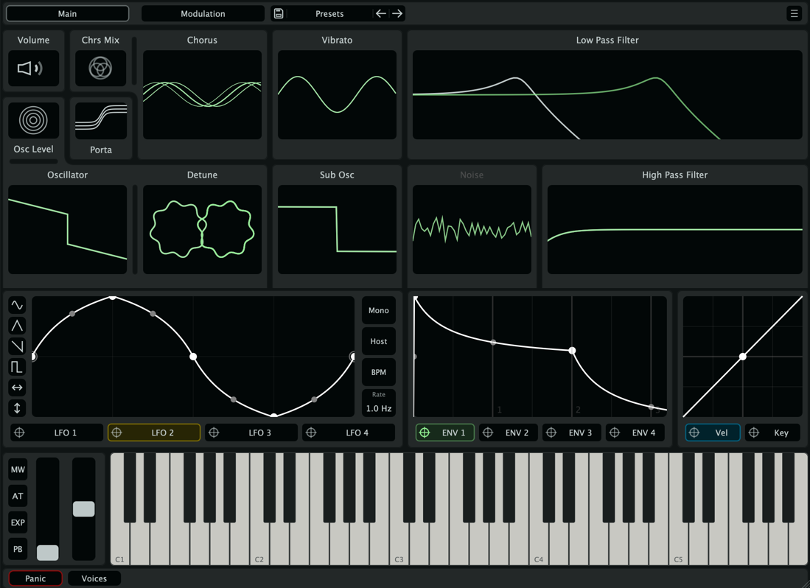

# Gesture Synth

**A gesture-driven, Juno-inspired polyphonic synthesizer plugin.**
Built from scratch in modern C++ with JUCE — Standalone, AU, VST3, AUv3, and CLAP.




---

## Overview

Gesture Synth is an original, fully-featured subtractive synthesizer in the spirit of the
classic Roland Juno line — a band-limited DCO, a morphing sub-oscillator, a resonant
state-variable filter, lush chorus/delay/reverb, and a deep modulation system.

Every part of it — the DSP, the modulation engine, and the entire custom UI — was written
from the ground up rather than assembled from tutorials or stock components. The defining
feature is its **gesture-based modulation workflow**: instead of hunting through dropdown
menus, you flip the synth into modulation mode and physically *drag a source onto any
control* to route it, then drag to dial in the depth — with live connector lines drawn
between everything that's wired together.

## Highlights

- **Gesture-based modulation matrix** — drag a source onto any knob to route it; visual
  connectors show the whole modulation graph at a glance. (See below.)
- **Hand-written DSP** — PolyBLEP anti-aliased, 4× oversampled DCO; a 16-line
  feedback-delay-network reverb; a bucket-brigade (BBD) analog-style delay.
- **Real-time-safe by construction** — lock-free UI↔audio messaging, cached atomic
  parameters, denormal protection. No locks or allocations on the audio thread.
- **Expressive playability** — 4 curve-shaped envelopes, 4 LFOs with a custom waveform
  editor, full MIDI expression (velocity, aftertouch, mod wheel, expression, pitch bend),
  plus mono/legato/portamento modes.
- **Bespoke interface** — a custom JUCE LookAndFeel with live oscilloscope, filter,
  envelope and LFO visualizers; resizable from 0.5× to 1.5×.

## The gesture-based modulation workflow

This is what the name is about. Modulation routing on most synths means picking a source
and a destination from two menus and typing a number. Gesture Synth turns it into a direct
gesture:

1. **Enter modulation mode** and pick a source — any of the 4 LFOs, 4 envelopes, velocity,
   keyboard tracking, mod wheel, aftertouch, expression, or pitch bend.
2. **Drag the source onto any control** on the panel to create a routing — no menus, no
   slot numbers.
3. **Drag on the dial to set the amount**, with bipolar/unipolar and per-routing bypass a
   click away.
4. **See the whole graph** — connector lines are drawn live between sources and every
   destination they touch, so the patch's modulation structure is visible, not hidden.

Everything is backed by a 16-slot modulation matrix, serialized with the rest of the patch,
and fully **undoable**.

## Features

### Sound engine
- **JuneDCO** — dual sawtooth + pulse/PWM oscillator with **PolyBLEP anti-aliasing** and
  **4× oversampling** (latency reported to the host), plus stereo detune and width.
- **Sub-oscillator** that morphs continuously across sine → triangle → square → saw.
- **Noise generator** with a sweepable tone filter.

### Filters
- Resonant **state-variable (TPT) low-pass** filter.
- Cascaded **high-pass** filter.
- Both fully modulatable, with **live frequency-response graphs**.

### Modulation
- **4 × ADSR envelopes** with independent per-stage curve shaping (log ↔ exp).
- **4 × LFOs** with a custom point-based waveform editor and host **tempo sync**.
- **MIDI sources:** velocity (with response curve), keyboard tracking, mod wheel (CC1),
  expression (CC11), channel aftertouch, and pitch bend.
- **16-slot modulation matrix** reaching ~17 destinations (cutoff, resonance, pitch, PWM,
  detune, sub level, vibrato, chorus, levels, and more).

### Effects
- **Chorus** — Juno-style stereo chorus.
- **BBD delay** — bucket-brigade-style delay with tempo sync, ping-pong, feedback
  saturation, diffusion, and tone controls.
- **Reverb** — a **16-line feedback delay network** with Walsh–Hadamard mixing,
  frequency-dependent decay, pre-delay, and input/output diffusion.
- **Soft-clip limiter** using a tanh Padé approximant for clean polyphonic headroom.

### Voice & performance
- Polyphonic with a configurable voice count; **mono** and **legato** modes.
- Exponential **portamento/glide** and sustain-pedal handling.

### Presets & tempo
- Categorized preset browser with save/load via `ValueTree` serialization.
- Full host tempo sync for LFOs and delay.

### Interface
- Tabbed editor (Main / Keyboard / Modulation / Experiment) with a custom LookAndFeel.
- Real-time oscilloscope plus envelope, LFO, and filter visualizers.
- Resizable UI (0.5×–1.5×) with an on-screen velocity-sensitive keyboard.

## Architecture

```
MIDI in
   │
   ▼
MySynth  ── polyphonic voice manager (mono/legato/portamento, sustain pedal)
   │
   ▼
MySynthVoice  (× N)
   ├─ JuneDCO        saw + pulse/PWM, PolyBLEP, 4× oversampling
   ├─ Sub-oscillator morphing waveform, one octave down
   ├─ Noise          tone-shaped
   ├─ Mod matrix     4 env + 4 LFO + MIDI sources → ~17 destinations
   ├─ SVF low-pass   + cascaded high-pass
   └─ Vibrato / portamento
   │
   ▼
EffectsChain  ── Chorus → BBD Delay → FDN Reverb → soft-clip limiter
   │
   ▼
Audio out
```

The audio path is **real-time-safe by design**: APVTS parameter atomics are cached and read
directly on the audio thread, UI edits reach the DSP through a **lock-free command queue**,
denormals are guarded with `ScopedNoDenormals`, and there are no locks or heap allocations in
`processBlock`. Oversampling latency is reported back to the host for sample-accurate
alignment.

## Engineering highlights

A few things worth a closer look, depending on what you care about:

- **DSP** — PolyBLEP band-limiting, 4× oversampling with host latency reporting, a
  16-line FDN reverb with Walsh–Hadamard feedback mixing and frequency-split decay, and a
  BBD-style delay with diffusion and saturation.
- **Systems / C++20** — lock-free UI↔audio messaging, cached `std::atomic` parameter access,
  RAII throughout, denormal protection, and a strict no-allocation audio thread.
- **Software engineering** — modular CMake build, **Catch2** unit-test and benchmark targets,
  GitHub Actions CI building Linux/macOS/Windows, and `pluginval` validation.
- **UI** — a fully custom JUCE `LookAndFeel`, gesture-driven modulation routing with live
  connector rendering, and real-time DSP visualizers (oscilloscope, filter, envelope, LFO).

## Tech stack

- **Language:** C++20
- **Framework:** [JUCE 8](https://juce.com/)
- **Build:** CMake (≥ 3.25), via the [Pamplejuce](https://github.com/sudara/pamplejuce) template
- **Testing:** [Catch2](https://github.com/catchorg/Catch2) (tests + benchmarks)
- **Extras:** [clap-juce-extensions](https://github.com/free-audio/clap-juce-extensions) (CLAP format),
  [Melatonin Inspector](https://github.com/sudara/melatonin_inspector) (UI debugging)

## Building from source

### Prerequisites
- A C++20 compiler (Clang, MSVC, or GCC)
- [CMake](https://cmake.org/) **3.25+**
- macOS, Windows, or Linux

JUCE and the helper modules are git submodules, so clone recursively:

```bash
git clone --recurse-submodules https://github.com/TTeuber/GestureSynth.git
cd GestureSynth
# If you already cloned without submodules:
git submodule update --init --recursive
```

### Configure & build

```bash
cmake -B cmake-build-relwithdebinfo -DCMAKE_BUILD_TYPE=RelWithDebInfo
cmake --build cmake-build-relwithdebinfo --config RelWithDebInfo --target GestureSynth_Standalone
```

`GestureSynth_Standalone` builds the standalone app. The CMake project also defines targets for
the **AU**, **VST3**, **AUv3**, and **CLAP** plugins; on macOS the AU/VST3 builds are copied
into your user plug-ins folder automatically.

### Running the tests

```bash
cmake --build cmake-build-relwithdebinfo --target Tests
ctest --test-dir cmake-build-relwithdebinfo
```

## Project structure

```
source/
├── PluginProcessor.*     # Plugin entry point, state, tempo
├── PluginEditor.*        # Top-level editor window & layout
├── Synthesizer/          # MySynth voice manager + MySynthVoice
├── Processor/            # DSP: JuneDCO, Chorus, BBDDelay, Reverb, EffectsChain
├── Modulation/           # Mod matrix, ADSRs, LFOs, MIDI sources
├── Editor/               # Custom UI components, tabs, visualizers, LookAndFeel
├── Preset/               # Preset save/load & browser
└── Utility/              # Parameters, lock-free queue, atomic helpers, tempo sync
```

## Status

Active development, pre-1.0. The synthesis engine, modulation system, effects, and UI are all
functional; remaining work is polish and factory-preset authoring ahead of a public beta.

## License & credits

Released under the **GNU Affero General Public License v3.0** — see [`LICENSE`](LICENSE).
AGPL was chosen for its strong copyleft, ensuring derivative works (including network-served
ones) stay open.

Built with [JUCE](https://juce.com/), scaffolded from the
[Pamplejuce](https://github.com/sudara/pamplejuce) template, with CLAP support via
[clap-juce-extensions](https://github.com/free-audio/clap-juce-extensions) and UI debugging via
[Melatonin Inspector](https://github.com/sudara/melatonin_inspector).

## Author

**Tyler Teuber** — [github.com/TTeuber](https://github.com/TTeuber)

A from-scratch exploration of real-time audio DSP, lock-free architecture, and interaction
design. Questions and conversations welcome — feel free to reach out.
